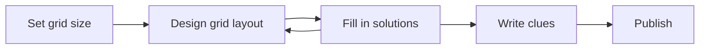

# KryssKross Project Guidelines

KryssKross is a web app for creating, sharing, and solving crossword puzzles.

## Project Vision

### Puzzle Types (Two Distinct Structures)

**Traditional crosswords** (Phase 1 – current focus)
- Grid with black squares for blocking, numbered cells, external clue lists (Across/Down)
- Numbering is derived algorithmically from the grid structure, not stored
- Supports both "quick" (straightforward) and "cryptic" (wordplay) clues—this is an authorial choice, not a structural difference
- Simpler data model establishes patterns before tackling complexity

**Arrow-words** (Phase 2 – future)
- Scandinavian style with clues embedded in grid cells, arrows indicating answer direction
- Requires richer per-cell metadata: clue text, arrow direction(s), line breaks, clue-cell vs answer-cell distinction
- Significantly more complex rendering and editing logic

### Core Features

- **Puzzle Construction:** Interactive grid editor with validation and feedback during creation
- **Puzzle Solving:** Interactive grid for inputting letters with clue highlighting and keyboard/mouse navigation
- **Sharing:** Private link sharing, embeddable via `<iframe>`
- **Export/Print:** Browser-native printing and PDF generation (blank or with solution)

### Sharing Model

**Private/unlisted by default**
- Puzzles are shared via direct links (like unlisted YouTube videos), not discoverable in a public directory
- Reduces editorial burden and moderation complexity
- Optional curated "featured" section could be added later with manual review

**User roles**
- Anonymous visitors: can solve puzzles via shared links only
- Registered users: can create puzzles, get shareable links, report/downvote others' puzzles (accounts created manually by admin—no public registration initially)
- Admin: can view reports, remove content, ban users, create user accounts

**Feedback mechanisms**
- Downvotes: lightweight quality signal ("not a great puzzle")
- Reports: rule violations requiring review, should include reason/category

**Embedding**
- Dedicated backend route (e.g., `/puzzles/{revisionId}/embed`) serves minimal HTML loading the solver component
- Users receive a simple `<iframe>` code snippet pointing to the embed URL

### Revision System

**Immutability principle**
- Each saved version of a puzzle is a distinct Revision with its own UUID
- Shared links always point to a specific revision—content never changes after sharing
- Prevents bait-and-switch (sharing benign content, then changing to something offensive)

**User experience**
- When viewing an older revision, users see a subtle notice if newer versions exist
- They can choose to view the latest or stay with the shared version
- Creators can add an optional "commit message" describing changes

**Data model concept**
- Puzzle: the conceptual work, belongs to a creator, has multiple Revisions
- Revision: immutable snapshot with own UUID, contains actual puzzle data, optional change message, timestamp

---

## Puzzle Representation

### Traditional Crosswords

**Cell Types:**
- `Blocked Cell`: Black squares that block words
- `Solution Cell`: White cell where solver inputs letters

**Dividers:** Some solutions are divided into multiple words, denoted by word length in clues. Dividers may be:
- A thicker border between cells (3,5)
- A hyphen across the border between cells (3-5)

**Data Format (Proposed):** JSON object per puzzle revision
- `metadata`: { id, title, width, height, createdAt, ... }
- `grid`: 2D array of cell types ('blocked' | 'solution')
- `solution`: 2D array of letters (for validation)
- `clues`: { across: [...], down: [...] } — arrays of clue objects

**Construction Workflow:**

Option: Rotational symmetry of black cells (common in traditional crosswords).

### Arrow-words (Phase 2)

**Cell Types:**
- `Solution Cell`: White cell where solver inputs letters
- `Clue Cell`: Adjacent non-solution cell containing clue text and directional arrow(s). May be visually divided (e.g., diagonally) for multiple clues
- `Empty Cell`: Unused grid space, visually distinct (e.g., SVG `<pattern>` fill with 45-degree hatch lines, Norwegian style)

**Data Format (Proposed):** JSON object per puzzle revision
- `metadata`: { id, title, width, height, ... }
- `grid`: 2D array representing cell types at each coordinate
- `clues`: Array of objects containing:
    - `text`: The clue string
    - `clueCellCoords`: { row, col } of the cell containing the clue/arrow
    - `solutionStartCoords`: { row, col } of the first letter
    - `direction`: 'across' | 'down'
    - `answer`: The solution string (for validation)
    - `status`: 'valid' | 'needs_review' | 'invalid' (managed during construction)

**Construction Workflow — Dual Editing Modes:**

1. **"Edit Solution" Mode:**
    - Focus: Defining grid structure by placing Solution and Empty cells
    - Logic: App automatically identifies contiguous Solution Cell sequences as potential words

2. **"Edit Clues" Mode:**
    - Focus: Associating text clues with identified potential words
    - UI: Highlights potential word starts; user selects to add/edit clue text
    - Logic: App attempts automatic arrow placement; handles multiple clues from same cell

**Validation on Solution Change:**
- When the solution layout is modified, all existing clues are re-evaluated
- Clues are marked as:
    - `Valid`: No issues
    - `Invalid`: Word path broken (suggest deletion)
    - `Needs Review`: Word path exists but length changed (user must verify)
- New potential words without clues are highlighted

---

## Solving Interface

### Common Features (Both Puzzle Types)
- Load puzzle data from backend API
- Render puzzle using SVG
- Letter input into Solution Cells
- Keyboard navigation (arrow keys, tab) and mouse navigation
- Highlight currently selected clue and corresponding cells
- Optional: "Check Puzzle", "Reveal Letter/Word" functionality

### Traditional-Specific
- Display Across/Down clue lists alongside grid
- Click clue to select word in grid, or click cell to highlight applicable clue

### Arrow-words-Specific
- Visual rendering of Clue Cells with arrows
- Pattern fills for Empty Cells

---

## Export & Print

**Print:** CSS `@media print` rules to optimize for browser printing (hide UI chrome, ensure clear lines/text)

**PDF Options:**
- Client-side: JS libraries (e.g., `jsPDF` + `svg2pdf.js`) to generate in browser
- Server-side: PHP libraries (e.g., `TCPDF`, `DomPDF`) or headless browser for robust generation

---

## Project Structure

The app is divided into a frontend and a backend part.

### Frontend

The React frontend handles the interactive puzzle experiences: the grid editor for creators and the solver for end users. All dashboard and administrative UI lives in FilamentPHP.

Built with React 19 and TypeScript, using Vite as the build tool. The codebase follows modern React practices:

- Functional components with hooks
- TypeScript for type safety
- React StrictMode enabled
- ESLint for code linting
- SVG-based rendering for puzzles (scalable for screen/print/PDF)
- Support for Norwegian characters (Æ, Ø, Å)

#### Key Technologies and Versions
- React: 19.1.0
- TypeScript: 5.8.3
- Vite: 6.3.5
- ESLint: 9.25.0

#### Directory Structure
- `/frontend/src/`: Main source code
    - `/components/`: React components
        - `/cell-types/`: Different cell type components for the crossword
    - `/types/`: TypeScript type definitions
    - `/assets/`: Static assets

#### Component Architecture
The crossword puzzle is built using SVG components:
- `CrosswordPuzzle`: Main component that renders the grid
- Cell components: Render individual cells based on type

#### Build and Development
- `npm run dev`: Start development server
- `npm run build`: Build for production
- `npm run lint`: Run ESLint
- `npm run preview`: Preview production build

### Backend

The backend is implemented as a Laravel API, responsible for user management and crossword puzzle storage. FilamentPHP provides the admin panel and creator dashboard interfaces.

#### Key Technologies
- Laravel: Latest version
- FilamentPHP: Admin panel and dashboard framework (built on Livewire)
- PHP: 8.5
- SQLite for database (development); PostgreSQL/MySQL for production

#### FilamentPHP Usage
Filament serves as both the admin panel and creator dashboard, handling all non-interactive-grid functionality:
- **Authentication**: Login flow (registration closed; accounts created manually by admin)
- **Creator dashboard**: Puzzle list, revision history, share link management, statistics
- **Admin panel**: Content moderation, user management, viewing reports

The React editor is launched from within the Filament dashboard when creating or editing puzzles.

#### Directory Structure
Standard Laravel structure:
- `/app/`: Core application code
- `/config/`: Configuration files
- `/database/`: Migrations and seeders
- `/routes/`: API and web routes
- `/tests/`: Pest tests

#### API Endpoints (Planned)
- `GET /api/puzzles/{revisionId}`: Load puzzle for solving
- `POST /api/puzzles`: Create new puzzle
- `POST /api/puzzles/{puzzleId}/revisions`: Create new revision
- `POST /api/puzzles/{revisionId}/report`: Report content
- `POST /api/puzzles/{revisionId}/vote`: Downvote

---

## Development Guidelines

### Philosophy
- "Doing it properly" is the priority, accepting the additional effort this requires
- Test-driven development (TDD) where it makes sense
- Proper architecture: dependency injection, testability, clean abstractions
- Starting with simpler traditional crosswords to establish patterns before adding arrow-words

### Code Style
- Use functional components with hooks for React
- Follow TypeScript best practices with proper type definitions
- Use ESLint to maintain code quality
- Follow Laravel conventions for backend code

### Git Workflow
- Create feature branches for new features
- Submit pull requests for code review
- Keep commits focused and with descriptive messages

### Testing
- Frontend: Testing framework to be determined (Vitest likely)
- Backend: Pest for Laravel tests

---

## Development Priorities

### Phase 1: Traditional Crosswords (Current)
1. Set up Laravel backend with FilamentPHP, database models, basic API
2. User accounts and authentication (invitation-only, manual account creation)
3. Frontend: Core SVG rendering for traditional grid (blocked/solution cells)
4. Frontend: Grid editor for designing puzzle layout
5. Frontend: Solution entry and clue editing
6. Frontend: Solving interface with navigation and clue highlighting
7. Backend: Revision system and sharing links
8. Implement embedding (`<iframe>`)
9. Print/PDF export

### Phase 2: Arrow-words
1. Extend data models for arrow-words cell types
2. Frontend: Clue Cell and Empty Cell rendering (including pattern fills)
3. Frontend: Dual-mode editor (Edit Solution / Edit Clues)
4. Frontend: Validation logic for clue status
5. Frontend: Arrow-words solving interface

### Future Considerations
- Public registration (if needed)
- Public featured gallery with curation
- Collaborative puzzle creation
- Puzzle statistics and analytics

---

## Teaching Context

This project serves as a React + TypeScript learning vehicle. The developer is an experienced PHP developer comfortable with vanilla JavaScript DOM manipulation, but less familiar with React patterns, async JavaScript, and promises. Guidance should explain concepts and patterns rather than providing finished code.
